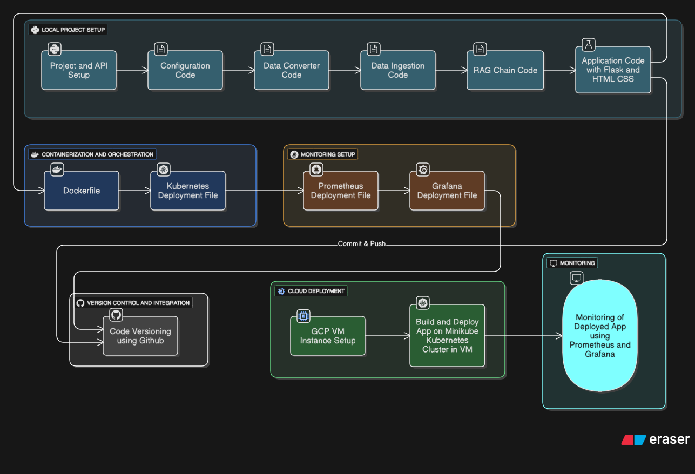

# Flipkart Product Recommender System: AI-Powered E-Commerce Discovery


[](https://github.com/HamzaImtiaz03/Flipcart_Product_Recommender)
[](https://opensource.org/licenses/MIT)
[](https://www.python.org/)
[](https://www.docker.com/)
[](https://kubernetes.io/)
[](https://cloud.google.com/)

## Overview

The **Flipkart Product Recommender System** is a cutting-edge AI-driven platform that enhances e-commerce experiences by delivering personalized product recommendations. Utilizing Retrieval-Augmented Generation (RAG) techniques, it processes product data from Flipkart datasets, retrieves relevant items via semantic search, and generates tailored suggestions using advanced language models. This system is designed for scalability, integrating seamless data ingestion, vector embeddings, and a responsive web interface to simulate real-world recommendation engines.

Ideal for e-commerce developers, data scientists, and businesses, this project showcases end-to-end MLOps practices—from local development to cloud-native deployment on Google Cloud Platform (GCP) with Kubernetes orchestration and comprehensive monitoring via Prometheus and Grafana. It leverages Astra DB for efficient vector storage, ensuring fast, accurate recommendations while maintaining observability and reliability.

## Key Features

- **RAG-Based Recommendations**: Combines data ingestion from PDFs/CSV (e.g., Flipkart product catalogs), vector embeddings, and Groq-powered generation for context-aware product suggestions.
- **Data Pipeline**: Automated ingestion, conversion, and storage using LangChain and Astra DB for scalable vector search.
- **Web Interface**: Flask backend with HTML/CSS frontend for user queries, integrated with Prometheus for metrics exposure.
- **Secure Configurations**: Environment variables and Kubernetes secrets for API keys (Groq, Hugging Face, Astra DB).
- **Containerization & Orchestration**: Dockerized app deployed on Kubernetes (via Minikube) for high availability and auto-scaling.
- **Cloud Deployment**: Hosted on GCP VM instances with integrated version control via GitHub.
- **Monitoring & Observability**: Prometheus for metrics collection and Grafana for dashboards, enabling real-time app performance tracking.
- **Modular Architecture**: Custom configuration, data converters, ingestion scripts, and RAG chain builders for easy extensibility.

## Architecture

The system follows a comprehensive, phased architecture encompassing local setup, core development, containerization, deployment, and monitoring, as illustrated in the flowchart below:

 <!-- Replace with actual image URL or embed -->

### High-Level Breakdown:
1. **Local Project Setup**: Project initialization, API configurations, virtual environment, data conversion, ingestion, RAG chain building, and Flask app with HTML/CSS.
2. **Containerization & Orchestration**: Dockerfile for building images, Kubernetes YAML for deployments and services.
3. **Version Control & Integration**: GitHub for code versioning and seamless pushes from local/VM environments.
4. **Cloud Deployment**: GCP VM setup, Minikube cluster creation, app deployment, and port-forwarding for access.
5. **Monitoring Setup**: Prometheus ConfigMap/Deployment for metrics scraping, Grafana Deployment for visualization and dashboards.

This architecture ensures robustness, from data handling to production monitoring, making it production-ready for e-commerce applications.

## Technologies Used

- **AI/ML Frameworks**: LangChain (core, AstraDB, Hugging Face, Groq, Community), Sentence-Transformers (implied via Hugging Face), Datasets (for loading).
- **Data Handling**: PyPDF (PDF ingestion), Pandas (data processing), Python-dotenv (environment management).
- **Backend & Web**: Flask (web framework), Prometheus Client (metrics).
- **Database**: Astra DB (vector database for embeddings).
- **Containerization & Orchestration**: Docker (containerization), Kubernetes (deployments via Minikube), Kubectl (management).
- **Cloud & Monitoring**: Google Cloud Platform (GCP VM), Prometheus (metrics), Grafana (dashboards).
- **Version Control**: GitHub.

Full dependencies are listed in `requirements.txt`.

## Installation

### Prerequisites
- Python 3.10+
- Git
- Docker (for containerization)
- Google Cloud Platform Account (for deployment)
- API Keys: Groq, Hugging Face, Astra DB (stored in `.env`)
- Optional: Minikube and kubectl for local Kubernetes testing

### Steps
1. **Clone the Repository**:
   ```
   git clone https://github.com/HamzaImtiaz03/Flipcart_Product_Recommender.git
   cd Flipcart_Product_Recommender
   ```

2. **Set Up Virtual Environment** (Recommended):
   ```
   python -m venv venv
   source venv/bin/activate  # On Unix/Mac
   # Or on Windows: venv\Scripts\activate
   ```

3. **Install Dependencies**:
   ```
   pip install -e .
   ```

4. **Configure Environment Variables**:
   Create a `.env` file in the root directory:
   ```
   GROQ_API_KEY=your_groq_api_key
   ASTRA_DB_APPLICATION_TOKEN=your_astra_token
   ASTRA_DB_KEYSPACE=your_keyspace
   ASTRA_DB_API_ENDPOINT=your_endpoint
   HF_TOKEN=your_huggingface_token
   HUGGINGFACEHUB_API_TOKEN=your_huggingface_token
   ```

5. **Prepare Dataset**:
   Place Flipkart product data (e.g., PDFs or CSVs) in the data directory. The system ingests and vectorizes them on startup.

## Usage

1. **Run the Application Locally**:
   ```
   python app.py
   ```
   - Access the recommender at `http://localhost:5000`.
   - Submit product queries (e.g., via form) to receive RAG-generated recommendations.

2. **Query Examples**:
   - "Recommend smartphones under 20,000 INR."
   - "Similar products to iPhone 14."
   - The RAG chain retrieves from Astra DB vectors and generates responses via Groq.

3. **Customization**:
   - Modify RAG chain parameters in `rag_chain.py`.
   - Extend data ingestion for new datasets.

## Deployment

This project supports cloud-native deployment on GCP with Kubernetes for orchestration and Prometheus/Grafana for monitoring.

### Prerequisites
- GCP VM Instance (configured as per `FULL DOCUMENTATION.md`).
- Minikube and Helm installed on the VM.
- Kubernetes secrets for API keys.

### Pipeline Overview
1. **Build Docker Image**: Containerize the app using Dockerfile.
2. **Deploy to Kubernetes**: Apply `flask-deployment.yaml` for Deployment and LoadBalancer Service.
3. **Set Up Monitoring**: Apply Prometheus and Grafana YAMLs in `monitoring` namespace.
4. **Access & Monitor**: Port-forward services; visualize metrics in Grafana.

### Detailed Steps
- Follow `FULL DOCUMENTATION.md` for GCP VM setup, Docker/Minikube installation, Kubernetes deployment, secrets creation, and Prometheus/Grafana configuration.
- Build and run Docker image locally:
  ```
  docker build -t flipkart-recommender .
  docker run -p 5000:5000 flipkart-recommender
  ```
- Deploy to GCP Kubernetes:
  ```
  eval $(minikube docker-env)
  docker build -t flask-app:latest .
  kubectl create secret generic llmops-secrets --from-literal=GROQ_API_KEY=your_key [add others]
  kubectl apply -f flask-deployment.yaml
  kubectl port-forward svc/flask-service 5000:80 --address 0.0.0.0
  ```
- For monitoring:
  ```
  kubectl apply -f prometheus/prometheus-configmap.yaml
  kubectl apply -f prometheus/prometheus-deployment.yaml
  kubectl apply -f grafana/grafana-deployment.yaml
  kubectl port-forward svc/prometheus-service -n monitoring 9090:9090 --address 0.0.0.0
  kubectl port-forward svc/grafana-service -n monitoring 3000:3000 --address 0.0.0.0
  ```
- Access Grafana at `http://external-ip:3000` (default credentials: admin/admin) and configure Prometheus as data source.

Once deployed, access the app via the external IP on port 5000 and monitor via Grafana dashboards.

## Contributing

Contributions are welcome to refine recommendations, add features, or enhance monitoring! To contribute:
1. Fork the repository.
2. Create a feature branch (`git checkout -b feature/YourFeature`).
3. Commit changes (`git commit -m 'Add YourFeature'`).
4. Push to the branch (`git push origin feature/YourFeature`).
5. Open a Pull Request.

Follow coding standards and include tests where applicable.

## License

This project is licensed under the MIT License - see the [LICENSE](LICENSE) file for details.

## Acknowledgments

- Frameworks: LangChain, Groq, Hugging Face, Astra DB.
- Tools: Flask, Docker, Kubernetes, Minikube, Prometheus, Grafana, GCP.
- Inspired by real-world e-commerce recommendation systems like Flipkart's.

For inquiries or support, open an issue on GitHub or contact [Hamza Imtiaz](mailto:hamzaimtiaz8668@example.com).

---

*Built by Hamza Imtiaz | Elevating E-Commerce with Intelligent Recommendations*